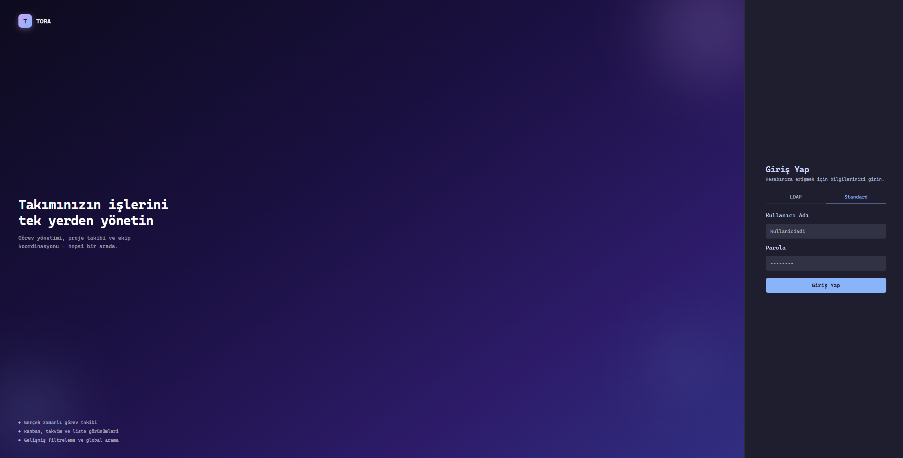
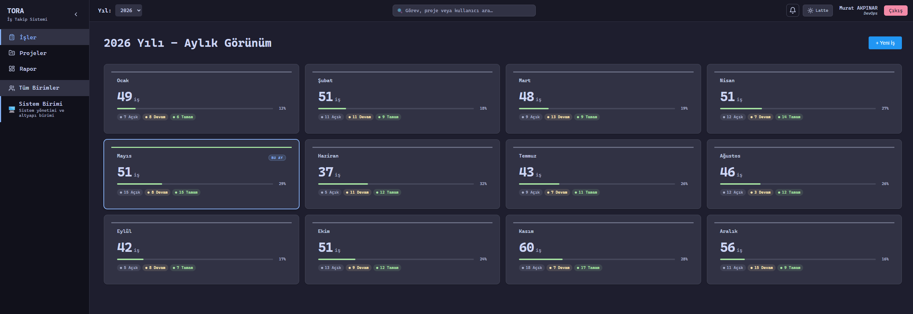
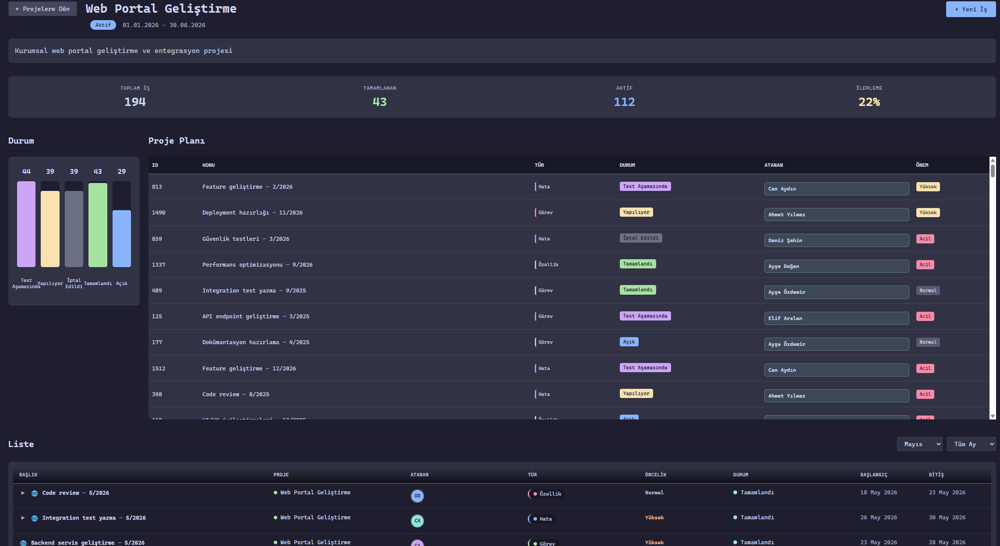
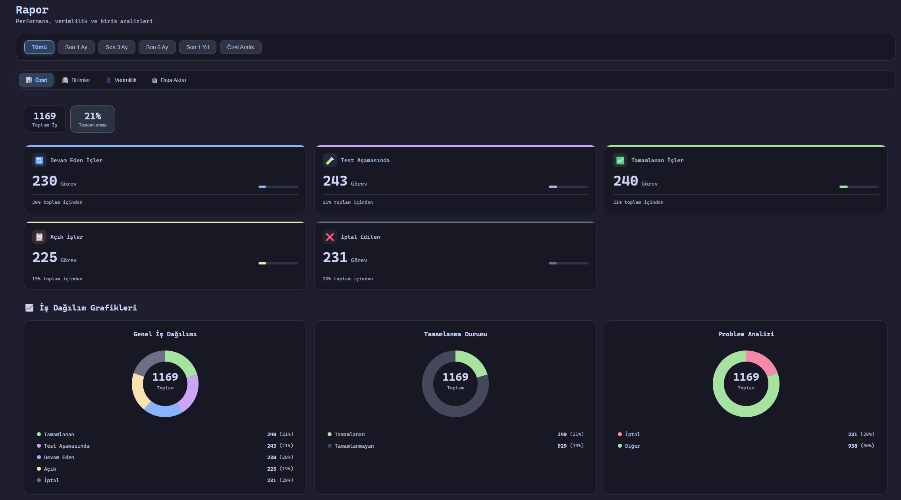
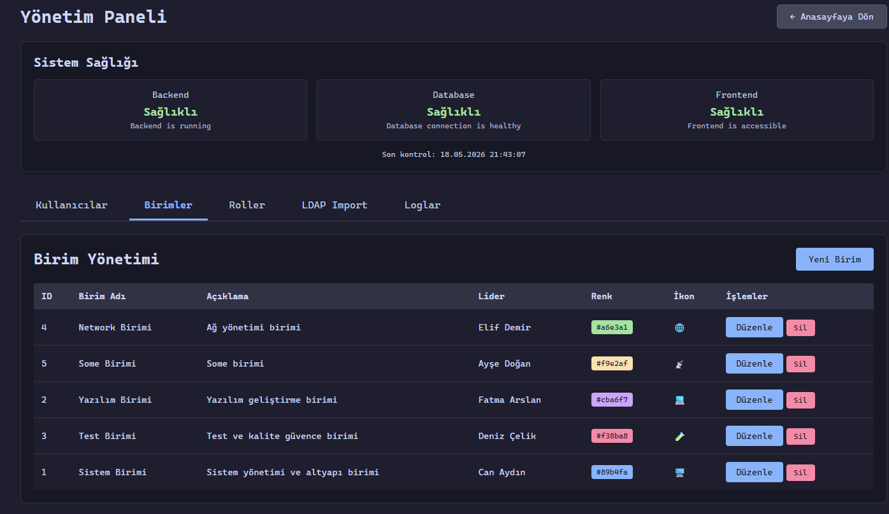
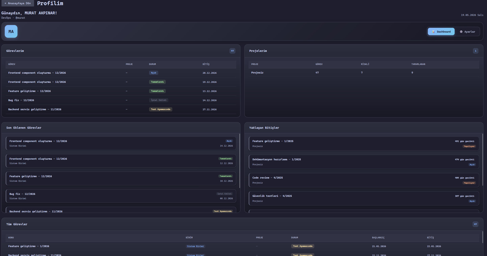

# TORA

[](LICENSE)
[](https://claude.com/claude-code)
[](https://github.com)
[](https://spring.io/projects/spring-boot)
[](https://react.dev)
[](https://www.postgresql.org)
[](https://www.docker.com)

TORA — Birimler için takvim odaklı proje ve görev yönetim platformu.

## Ekran Görüntüleri

<table>
  <tr>
    <td align="center" width="50%">
      
      <br/><sub><b>Giriş Ekranı</b></sub>
    </td>
    <td align="center" width="50%">
      
      <br/><sub><b>Birim Dashboard</b></sub>
    </td>
  </tr>
  <tr>
    <td align="center" width="50%">
      
      <br/><sub><b>Proje Yönetimi</b></sub>
    </td>
    <td align="center" width="50%">
      
      <br/><sub><b>Raporlar</b></sub>
    </td>
  </tr>
  <tr>
    <td align="center" width="50%">
      
      <br/><sub><b>Yönetim Paneli</b></sub>
    </td>
    <td align="center" width="50%">
      
      <br/><sub><b>Profil</b></sub>
    </td>
  </tr>
</table>

## Özellikler

- **Çok Seviyeli Yetkilendirme**: Yönetici (ADMIN), Birim Amiri (BIRIM_AMIRI) ve Personel rolleri
- **Hibrit Authentication**: Hem LDAP hem de Local User desteği (LDAP önce denenir, başarısız olursa local user kontrol edilir)
- **JWT Authentication**: Stateless authentication (session problemi yok, yatay ölçeklendirme için uygun)
- **Otomatik Database Migration**: Liquibase ile veritabanı şeması otomatik oluşturulur
- **Yönetim Paneli**: 
  - Kullanıcı yönetimi (oluşturma, düzenleme, silme, admin rolü atama)
  - Birim yönetimi (oluşturma, düzenleme, silme, renk/ikon ayarlama)
  - Rol yönetimi (genel rol havuzu)
  - LDAP ayarları yönetimi (UI'dan bağlantı ayarları, şifreli saklama, test butonu)
  - LDAP kullanıcı import (arama ve import)
  - Sistem sağlığı kontrolü (Backend, Database, Frontend API)
- **Kullanıcı Profil Sistemi**: 
  - Profil bilgileri görüntüleme
  - Atanan işler listesi
  - İsim değiştirme
  - Şifre değiştirme
  - Giriş geçmişi (son 10 giriş: IP, tarih, başarı durumu)
  - Aktif oturum yönetimi (cihaz/IP/tarih listesi, tek oturumu veya tüm diğer cihazları sonlandırma)
- **Bildirim Sistemi**: Görev atama, durum değişimi, bitiş tarihi yaklaşımı, yorum mention bildirimleri. Header'da okunmamış sayısı + dropdown panel (okunmuş=soluk, okunmamış=canlı renk)
- **Görev Yorumları**: Görev modalında yorum bölümü, @mention otomatik tamamlama, mention edilenlere bildirim
- **Esnek Etiket Sistemi**: Birim bazlı görev etiketleri (task_labels), renk destekli, görev türlerinin yerini aldı
- **Çoklu Görünüm Modları**: 
  - Takvim Görünümü: Günlük takvim görünümü, hafta sonu günleri soluk, responsive tasarım
  - Gantt Chart: Timeline bazlı Gantt chart, hafta seçimi, hiyerarşik subtask desteği, responsive tasarım
  - Kanban Board: Status bazlı Kanban board, her takım için ayrı, responsive tasarım
  - Liste Görünümü: Tablo tabanlı, 20 kayıt/sayfa pagination, subtask expand/collapse
- **Aylık Görünüm**: 12 ay grid görünümü, mevsim renkleri ile, responsive grid düzeni
- **Sidebar Toggle**: Sol menüyü gizleme/gösterme özelliği (localStorage ile state yönetimi)
- **Proje Yönetimi**: Proje oluşturma, düzenleme, silme. Projelere ekip atama ve iş ekleme
- **Proje Detay Görünümü**: Durum dağılımı grafiği, görev listesi ve Gantt chart ile detaylı proje takibi
- **Proje Uyarı Sistemi**: Bitim tarihine 1 gün kalan projeler otomatik yanıp söner
- **Birim Renkleri ve İkonları**: Her birimin kendine özel emoji ikonu ve rengi var (🖥️ Sistem, 🌐 Network, 📡 Some, 💻 Yazılım, 🧪 Test), sidebar'da ve toplu görünümlerde ayırt etmeyi kolaylaştırır
- **Birim Dashboard**: Gerçek zamanlı istatistikler, donut grafikler, ilerleme çubukları
- **Birim Üyeleri**: Overview sayfasında birim seçildiğinde o birimin üyeleri, rolleri ve lideri gösterilir
- **İş Kartları**: Detaylı iş takibi, alt işler, durum yönetimi, önem seviyesi icon'ları
- **İş Türleri ve Öncelikler**: Görev (TASK), Özellik (FEATURE), Hata (BUG) / Normal, Yüksek, Acil
- **Ertelendi Takibi**: Ertelenen işlerin yeni tarih bilgisi ile takibi
- **Yetişmedi Hesaplama**: Otomatik yetişmedi iş tespiti
- **Örnek Veri Ekleme**: `.env` dosyasında `SEED_SAMPLE_DATA=1` yaparak otomatik örnek veri ekleme (çoğu birimde 1 Birim Amiri + 4 personel; **Sistem Birimi** örneğinde yalnızca Melda / Murat / Mustafa üçlüsü, güncel yıl için işler ve projeler)
- **Arama & Filtreleme**: Global header arama çubuğu (görev/proje/kullanıcı), PostgreSQL GIN full-text search (`tsvector`/`tsquery`), debounce 300 ms, varlık türüne göre gruplama, gelişmiş filtre paneli (durum, öncelik, etiket, atanan), kaydedilmiş filtreler (kullanıcı başına maks. 20)
- **SLA Takibi**: Öncelik/birim bazlı SLA politikaları (yönetim panelinden CRUD), görev başına SLA durumu (zamanında/riskli/aşıldı/karşılandı) ve görev kartında rozet, ihlal/risk bildirimleri (scheduled job), SLA uyum oranı metriği. Opsiyonel mesai-saati (hafta sonu duraklatma) modu.
- **Performans**: Caffeine in-memory cache (dashboard + kullanıcı detayları, 5 dk TTL), route-level lazy loading, Vite chunk splitting, DB index optimizasyonu (V23 + V25 + V26), N+1 sorgu giderimi (`@BatchSize` + JOIN FETCH), dashboard SQL aggregation, JWT filter user cache, kanban yerel state güncelleme
- **Docker Desteği**: Tam containerized yapı, yatay ölçeklendirme için hazır

## Teknoloji Stack

### Backend
- Spring Boot 3.2
- PostgreSQL 15
- Spring Security + LDAP + JWT
- Liquibase (Database Migrations)
- Java 17

### Frontend
- React 18
- TypeScript
- Vite
- React Router
- Axios
- date-fns (tarih işlemleri)
- Cascadia Mono (font)

### Infrastructure
- Docker & Docker Compose
- Nginx (Load Balancer)
- PostgreSQL

## Kurulum

### Gereksinimler
- Docker & Docker Compose
- Java 17+ (local development için)
- Node.js 20+ (local development için)

### Docker ile Çalıştırma

1. Repository'yi klonlayın:
```bash
git clone <repository-url>
cd TORA
```

2. `.env` dosyasını oluşturun:
```bash
cp .example.env .env
```

Ardından `.env` dosyasını açıp `JWT_SECRET` ve `ENCRYPTION_KEY` değerlerini üretin:

```bash
# Linux/Mac
openssl rand -base64 32

# PowerShell
[Convert]::ToBase64String((1..32 | ForEach-Object { [byte](Get-Random -Max 256) }))

# Python
python -c "import secrets; print(secrets.token_urlsafe(32))"
```

3. Docker Compose ile başlatın:
```bash
docker compose up -d
```

**Not:** Database tabloları Spring Boot başlarken otomatik olarak Liquibase migration'ları ile oluşturulur. Manuel bir şey yapmanıza gerek yok.

3. (Opsiyonel) LDAP Test Sunucusunu Başlatma

LDAP test etmek için dahili test sunucusu kullanabilirsiniz:

```bash
# Ana proje zaten çalışıyor olmalı
cd ldap_test
docker-compose up -d

# Test kullanıcılarını ekle
./init-ldap.sh
```

LDAP test sunucusu otomatik olarak ana projenin Docker network'üne bağlanır. Yönetim panelinden LDAP ayarlarını yapılandırabilirsiniz:

- **URLs**: `ldap://ldap-test:389` (Docker içinden) veya `ldap://localhost:389` (host'tan test için)
- **Base**: `dc=test,dc=local`
- **Username**: `cn=admin,dc=test,dc=local`
- **Password**: `admin123`
- **User Search Base**: `ou=users`
- **User Search Filter**: `(uid={0})`

**Önemli:** LDAP ayarları artık sadece yönetim panelinden (database) okunuyor. Docker-compose veya application.yml'den okunmuyor. Bu sayede LDAP sadece yetkili adminler tarafından yapılandırılabilir.

**phpLDAPadmin:** Web tabanlı LDAP yönetim arayüzüne http://localhost:8082 adresinden erişebilirsiniz.

4. Uygulamaya erişin:
- Frontend: http://localhost:81
- Backend API: http://localhost:8081

### Ortam Değişkenleri (`.env`)

| Değişken | Açıklama | Varsayılan |
|----------|----------|-----------|
| `JWT_SECRET` | JWT imzalama anahtarı. Min. 256 bit, Base64. Production'da mutlaka değiştirilmeli. | — (zorunlu) |
| `JWT_EXPIRATION` | Token geçerlilik süresi (ms). 86400000 = 24 saat. | `86400000` |
| `ENCRYPTION_KEY` | LDAP şifrelerini şifrelemek için AES-256 anahtarı. Min. 32 karakter, Base64. | — (zorunlu) |
| `ENCRYPTION_SALT` | PBKDF2 anahtar türetme tuzu. Production'da rastgele değer atanmalı. | `Tora-v2` |
| `ENFORCE_SECRET_VALIDATION` | `true` yapılırsa default/boş secret ile uygulama başlamaz. Production'da `true` olmalı. | `false` |
| `SEED_SAMPLE_DATA` | `1` yapılırsa uygulama ilk başlatmada örnek veri ekler. | `0` |
| `DB_HOST` / `DB_PORT` / `DB_NAME` | PostgreSQL bağlantı bilgileri. | `postgres` / `5432` / `tora` |
| `DB_USER` / `DB_PASSWORD` | PostgreSQL kullanıcı adı ve şifresi. | `postgres` / `postgres` |
| `FRONTEND_URL` | CORS izin verilen kaynak. Nginx arkasında tam URL verilmeli. | `http://frontend:8080` |

**Production ortamı için minimum değişiklikler:**
```bash
ENFORCE_SECRET_VALIDATION=true
JWT_SECRET=<openssl rand -base64 32 çıktısı>
ENCRYPTION_KEY=<openssl rand -base64 32 çıktısı>
ENCRYPTION_SALT=<openssl rand -base64 16 çıktısı>
DB_PASSWORD=<güçlü bir şifre>
```

> `ENFORCE_SECRET_VALIDATION=true` ile backend, varsayılan veya boş secret kullanıldığında başlamayı reddeder — production'da yanlışlıkla test secret'ı bırakılmasını önler.

### Yatay Ölçeklendirme

Backend container'larını ölçeklendirmek için:
```bash
docker-compose up -d --scale backend=3
```

JWT kullanıldığı için session problemi olmaz. Her request stateless'tir.

### Local Development

#### Backend
```bash
cd Backend
mvn spring-boot:run
```

#### Frontend
```bash
cd Frontend
npm install
npm run dev
```

## Veritabanı Yapısı

- `users` - Kullanıcılar (soft delete desteği ile isActive alanı)
- `roles` - Roller (ADMIN, BIRIM_AMIRI, YAZILIMCI, DEVOPS, IS_ANALISTI, TESTCI)
- `teams` - Birimler (her birimin kendine özel emoji ikonu ve rengi var, soft delete desteği ile isActive alanı)
- `ldap_settings` - LDAP bağlantı ayarları (şifreli saklama)
- `projects` - Projeler (başlangıç/bitiş tarihi, durum, ekip atamaları)
- `project_teams` - Proje-Ekip ilişkisi (many-to-many)
- `tasks` - İş kartları (projeye bağlı olabilir)
- `subtasks` - Alt işler
- `task_status_history` - İş durum geçmişi
- `task_logs` - İş işlem logları (oluşturma, güncelleme, silme, durum değişiklikleri)
- `system_logs` - Sistem logları (backend ve frontend logları)
- `user_teams` - Kullanıcı-Ekip ilişkisi
- `user_roles` - Kullanıcı-Rol ilişkisi
- `login_attempts` - Giriş denemeleri (rate limiting ve account lockout için)
- `task_comments` - Görev yorumları (author, content, is_edited)
- `task_comment_mentions` - Yorum @mention ilişkisi (many-to-many)
- `notifications` - Kullanıcı başına in-app bildirimler (okundu/okunmadı, tip, tetikleyen)
- `task_labels` - Birim bazlı görev etiketleri (renk destekli)
- `task_label_assignments` - Görev-Etiket ilişkisi (many-to-many)
- `saved_filters` - Kullanıcı başına kaydedilmiş arama filtreleri (maks. 20/kullanıcı)

### Entity Konvansiyonları

Tüm JPA entity'lerde Lombok kullanımı aşağıdaki kurallara uyar:
- **`@Data` kullanılmaz** — Circular referans oluşturan `hashCode()`/`toString()` ile StackOverflow ve connection leak riski taşır
- **`@Getter` + `@Setter`** kullanılır
- **`@EqualsAndHashCode(of = "id")`** — Sadece primary key üzerinden eşitlik kontrolü
- **`@ToString(exclude = {...})`** — Lazy collection'lar exclude edilir (örn: `members`, `tasks`, `teams`)

## API Endpoints

### Authentication
- `POST /api/auth/login` - Login (LDAP veya Local User)
- `POST /api/auth/register` - Local user oluştur **(ADMIN rolü gerekli)**
- `GET /api/auth/me` - Mevcut kullanıcı bilgisi

### Teams (Birimler)
- `GET /api/teams` - Birimler listesi
- `GET /api/teams/{id}` - Birim detayı
- `GET /api/teams/{id}/dashboard` - Birim dashboard istatistikleri
- `GET /api/teams/{id}/dashboard/details` - Birim dashboard detayları (üyeler, leaderboard)
- `GET /api/teams/dashboard/details` - Tüm birimlerin dashboard detayları

### Tasks
- `GET /api/tasks` - İşler listesi (filtreleme: teamId, year, month)
- `GET /api/tasks/{id}` - İş detayı
- `POST /api/tasks` - Yeni iş oluştur
- `PUT /api/tasks/{id}` - İş güncelle
- `DELETE /api/tasks/{id}` - İş sil
- `PUT /api/tasks/{id}/status` - İş durumu güncelle

### Projects
- `GET /api/projects` - Projeler listesi
- `GET /api/projects/{id}` - Proje detayı
- `POST /api/projects` - Yeni proje oluştur
- `PUT /api/projects/{id}` - Proje güncelle
- `DELETE /api/projects/{id}` - Proje sil

### Arama & Filtreler
- `GET /api/search?q=<sorgu>` - Global arama (görev + proje + kullanıcı, erişim kontrolüne göre filtrelenir)
- `GET /api/saved-filters` - Oturumdaki kullanıcının kaydedilmiş filtreleri
- `POST /api/saved-filters` - Yeni filtre kaydet (`{ name, filterJson }`)
- `DELETE /api/saved-filters/{id}` - Kaydedilmiş filtreyi sil (sahiplik kontrolü)

### Admin Logs (ADMIN rolü gerekli)
- `GET /api/admin/logs/system` - Sistem logları (source, level, userId, startDate, endDate parametreleri ile)
- `GET /api/admin/logs/system/backend` - Backend logları
- `GET /api/admin/logs/system/frontend` - Frontend logları
- `POST /api/admin/logs/system/frontend` - Frontend'den log gönderme
- `GET /api/admin/logs/tasks` - İş logları (taskId, userId, action, startDate, endDate parametreleri ile)
- `GET /api/admin/logs/tasks/user/{userId}` - Belirli kullanıcının iş geçmişi

### Calendar
- `GET /api/calendar/{year}` - Yıl bazlı takvim verisi
- `GET /api/calendar/{year}/{month}` - Ay bazlı takvim verisi

## Yetkilendirme

### Hiyerarşi
**Yönetici (ADMIN) > Birim Amiri (BIRIM_AMIRI) > Personel**

### Yönetici (ADMIN)
- Tüm birimleri görüntüleyebilir
- Tüm işleri görebilir/düzenleyebilir
- Tüm dashboard'ları görebilir
- Yönetim paneline erişebilir
- Sistem sağlığı kontrolü yapabilir

### Birim Amiri (BIRIM_AMIRI)
- Liderliğini yaptığı birimleri görüntüleyebilir
- Kendi birimlerinin işlerini yönetebilir
- Kendi birimlerinin dashboard ve üye listesini görebilir
- Sistem sağlığı kontrolü yapabilir

### Personel
- Sadece üyesi olduğu birimleri görüntüleyebilir
- Kendisine atanan işleri görebilir
- Sadece kendi işlerini düzenleyebilir

## Authentication

### Varsayılan Admin Kullanıcı

Uygulama ilk başlatıldığında otomatik olarak bir admin kullanıcı oluşturulur:
- **Kullanıcı Adı:** `admin`
- **Şifre:** `admin`
- **Rol:** Yönetici (ADMIN)
- **Erişim:** Tüm ekiplere ve işlere erişim

**Önemli:** İlk girişten sonra şifrenizi değiştirmeniz önerilir.

### LDAP + Local User Hibrit Sistemi

Sistem önce LDAP'de kullanıcıyı arar, başarısız olursa database'deki local user'ları kontrol eder:

1. **LDAP Authentication** (eğer yönetim panelinden `isEnabled=true` yapılmışsa):
   - Kullanıcı LDAP sunucusunda aranır
   - Başarılı olursa kullanıcı database'e senkronize edilir
   - LDAP kullanıcılarının password'ü database'de saklanmaz
   - **Önemli:** LDAP ayarları sadece yönetim panelinden yapılır, docker-compose veya application.yml'den okunmaz

2. **Local User Authentication**:
   - LDAP başarısız olursa veya yönetim panelinden `isEnabled=false` ise
   - Database'deki kullanıcılar kontrol edilir
   - Password BCrypt ile hash'lenmiş olarak saklanır

### LDAP Test Sunucusu

Proje içinde LDAP test sunucusu bulunmaktadır (`ldap_test` dizini). Test sunucusu:

- Ana projenin Docker network'üne otomatik bağlanır
- Container adı: `ldap-test`
- Port: 389 (LDAP), 8082 (phpLDAPadmin)
- Base DN: `dc=test,dc=local`
- Admin DN: `cn=admin,dc=test,dc=local`
- Admin Password: `admin123`

**Kurulum:**
```bash
# Ana projeyi başlatın (eğer henüz başlatmadıysanız)
docker-compose up -d

# LDAP test sunucusunu başlatın (ana proje dizininden)
docker-compose -f ldap_test/docker-compose.yml up -d

# VEYA ldap_test dizinine girip:
cd ldap_test
docker-compose up -d
```

**Test Kullanıcılarını Ekleme:**
LDAP container başladıktan sonra test kullanıcılarını eklemek için init scriptini manuel olarak çalıştırın:
```bash
docker exec ldap-test bash /init-users.sh
```

**Yönetim Panelinden Yapılandırma:**
1. LDAP test sunucusu başlatıldıktan sonra test kullanıcılarını eklemek için `docker exec ldap-test bash /init-users.sh` komutunu çalıştırın (`ou=users` ve `ou=groups` OU'ları otomatik oluşturulur).

2. Admin panel → LDAP Ayarları
3. Aşağıdaki bilgileri girin:
   - **URLs**: `ldap://ldap-test:389` (Backend container'ı aynı Docker network'ünde olduğu için `ldap-test` hostname'i kullanılmalı)
   - **Base**: `dc=test,dc=local`
   - **Username**: `cn=admin,dc=test,dc=local`
   - **Password**: `admin123`
   - **User Search Base**: `ou=users,dc=test,dc=local` (tam DN path'i gerekli - init-ldap.sh çalıştırıldıktan sonra)
   - **User Search Filter**: `(uid={0})`
4. "LDAP'ı Aktif Et" checkbox'ını işaretleyin
5. "Bağlantıyı Test Et" butonuna tıklayın

**Önemli Notlar:**
- **User Search Base için tam DN path'i kullanın:** `ou=users,dc=test,dc=local`
- Eğer User Search Base boş bırakılırsa, Base DN (`dc=test,dc=local`) kullanılır
- LDAP container başladıktan sonra `docker exec ldap-test bash /init-users.sh` komutu ile test kullanıcıları eklenir

**Test Kullanıcıları:**
`docker exec ldap-test bash /init-users.sh` komutu çalıştırıldığında aşağıdaki test kullanıcıları oluşturulur:
- **ldap_user1** / Password: `ldappass123`
- **ldap_user2** / Password: `ldappass123`
- **testuser1** / Password: `testpass123`
- **testuser2** / Password: `testpass123`
- **adminuser** / Password: `adminpass123`

**phpLDAPadmin:** http://localhost:8082 adresinden web tabanlı LDAP yönetim arayüzüne erişebilirsiniz.

**Detaylı bilgi için:** `ldap_test/README.md` dosyasına bakın.

### Local User Oluşturma

Local kullanıcı oluşturmak için **ADMIN** yetkisi gerekir. Yönetim panelinden (Admin Panel → Kullanıcılar → Yeni Kullanıcı) ya da API üzerinden yapılabilir:

```bash
POST /api/auth/register
Authorization: Bearer <admin-jwt-token>

{
  "username": "testuser",
  "fullName": "Test User",
  "password": "password123",
  "role": "YAZILIMCI"
}
```

## Database Migration

**Otomatik Migration:** Spring Boot başlarken Liquibase migration dosyaları otomatik çalışır:
- `V1__initial_schema.xml` - Tüm tablolar oluşturulur
- `V2__seed_data.xml` - İlk roller ve ekipler eklenir
- `V3__add_password_to_users.xml` - Password kolonu eklenir
- `V4__create_admin_user.xml` - Admin kullanıcı oluşturulur
- `V5__add_subtask_fields.xml` - Alt işlere tarih ve atanan kişi alanları eklenir
- `V6__add_task_type_and_priority.xml` - İşlere tür ve öncelik alanları eklenir
- `V7__add_team_color_and_icon.xml` - Ekiplere renk ve ikon kolonları eklenir
- `V8__add_projects.xml` - Projeler tablosu ve ilişkileri oluşturulur
- `V9__add_soft_delete.xml` - Kullanıcı ve takımlara soft delete desteği (isActive alanı)
- `V10__rename_daire_baskani_to_admin.xml` - DAIRE_BASKANI rolü ADMIN olarak yeniden adlandırılır
- `V11__create_ldap_settings.xml` - LDAP ayarları tablosu oluşturulur (şifreli saklama)
- `V12__create_login_attempts.xml` - Giriş denemeleri tablosu oluşturulur (rate limiting için)
- `V13__create_system_logs.xml` - Sistem logları tablosu oluşturulur (backend ve frontend logları)
- `V14__create_task_logs.xml` - İş logları tablosu oluşturulur (tüm task işlemleri için)
- `V15__rename_teams_to_birim.xml` - Ekip isimleri Türkçe birim isimlerine güncellenir
- `V16__task_logs_preserve_deleted_task.xml` - task_logs'ta task_id nullable yapıldı, task_title kolonu eklendi
- `V17__add_departments.xml` - BIRIM_AMIRI rolü ve birim ikonları/renkleri eklendi
- `V18__remove_postponed_overdue_statuses.xml` - POSTPONED/OVERDUE görevler IN_PROGRESS'e taşındı
- `V19__create_task_comments.xml` - Görev yorumları tablosu (task_comments + task_comment_mentions)
- `V20__create_notifications.xml` - Kullanıcı bildirimleri tablosu (notifications + indexler)
- `V21__remove_admin_from_teams.xml` - Admin kullanıcısı birim üyeliklerinden çıkarıldı
- `V22__add_task_labels.xml` - Görev etiketleri (task_labels), mevcut task_type verisi etiketlere taşındı
- `V23__performance_indexes.xml` - Performans indeksleri: task_assignees(user_id), tasks(created_by), tasks(team_id, status)
- `V24__add_project_manager.xml` - Projelere proje yöneticisi (manager) kolonu eklendi
- `V25__performance_index_start_date.xml` - Composite index: tasks(team_id, start_date), tasks(project_id, start_date) — yıl/ay filtreleri için
- `V26__search_indexes.xml` - GIN full-text search index (tasks + projects) ve pg_trgm trigram index (users) — global arama performansı için
- `V27__saved_filters.xml` - `saved_filters` tablosu — kullanıcı başına kaydedilmiş arama/filtre tanımları

Manuel bir şey yapmanıza gerek yok, uygulama ilk çalıştığında tüm tablolar otomatik oluşturulur.

## İş Durumları

- **OPEN** (Açık) - Sleuthe Yellow (#feb300)
- **IN_PROGRESS** (Yapılıyor) - Coral Pink (#ff5e6c)
- **COMPLETED** (Tamamlandı) - Teal (#94e2d5)
- **POSTPONED** (Ertelendi) - Pink Leaf (#ffaaab) (yeni tarih bilgisi ile)
- **CANCELLED** (İptal Edildi) - Gri
- **OVERDUE** (Yetişmedi) - Coral Pink (#ff5e6c)

## İş Türleri ve Öncelikler

### İş Türleri
- **TASK** (Görev) - Pink Leaf (#ffaaab)
- **FEATURE** (Özellik) - Teal (#94e2d5)
- **BUG** (Hata) - Coral Pink (#ff5e6c)

### Öncelik Seviyeleri
- **NORMAL** (Normal) - Gri, ⚪ icon
- **HIGH** (Yüksek) - Sleuthe Yellow (#feb300), 🟠 icon
- **URGENT** (Acil) - Coral Pink (#ff5e6c), 🔴 icon

## Renk Paleti

Uygulama, Catppuccin Mocha renk paletini kullanmaktadır.

- **Arka Plan**: `--ctp-base` (koyu morumsu gri)
- **Yüzeyler**: `--ctp-surface0`, `--ctp-surface1`, `--ctp-crust` (daha açık gri tonları)
- **Metin**: `--ctp-text`, `--ctp-subtext0`, `--ctp-subtext1` (açık beyaz tonları)
- **Vurgu Renkleri**: `--ctp-blue`, `--ctp-green`, `--ctp-yellow`, `--ctp-peach`, `--ctp-red` vb.

## Birim Renkleri ve İkonları

Her birimin kendine özel emoji ikonu ve rengi vardır. Bu özellik sayesinde:
- Sidebar'da birimleri emoji ikonları ile hızlıca ayırt edebilirsiniz
- Toplu görünümlerde (Gantt Chart, Kanban Board, Takvim) birimleri renkleriyle ayırt edebilirsiniz
- İş kartlarında hangi birime ait olduğunu renk ve ikon ile görebilirsiniz

**Varsayılan Birim İkonları:**
| Birim | İkon | Renk |
|-------|------|------|
| Sistem Birimi | 🖥️ | #89b4fa |
| Network Birimi | 🌐 | #a6e3a1 |
| Some Birimi | 📡 | #f9e2af |
| Yazılım Birimi | 💻 | #cba6f7 |
| Test Birimi | 🧪 | #f38ba8 |

`teams` tablosunda `color` (VARCHAR(7)) ve `icon` (VARCHAR(50)) kolonları bulunur.

## Örnek Veri Ekleme

Uygulamayı test etmek için otomatik örnek veri ekleme özelliği bulunmaktadır:

1. `.env` dosyasında `SEED_SAMPLE_DATA=1` yapın
2. Backend'i yeniden başlatın: `docker-compose restart backend`

Bu özellik şunları ekler:
- Çoğu birimde 5 kullanıcı (1 Birim Amiri + 4 personel); **Sistem Birimi** için örnekte yalnızca 3 kullanıcı (Melda — birim amiri/lider; Murat ve Mustafa — DEVOPS)
- Birim amirleri otomatik olarak lider olarak atanır
- Güncel yıl için her ay 15-35 arası iş
- 5 örnek proje
- İşlerin %30'unda alt görevler

**Not:** Örnek veriler sadece ilk çalıştırmada eklenir. Mevcut kullanıcılar/işler varsa tekrar eklenmez.

## Yönetim Paneli Özellikleri

### Kullanıcı Yönetimi
- Local kullanıcı oluşturma (isim, email, username, şifre)
- Kullanıcı düzenleme (roller, takımlar, admin checkbox)
- Kullanıcı silme/deaktive etme (soft delete)
- Admin rolü atama/revoke (checkbox ile)

### Birim Yönetimi
- Birim oluşturma (isim, açıklama, renk, ikon, lider)
- Birim düzenleme
- Birim silme/deaktive etme (soft delete)

### Rol Yönetimi
- Genel rol havuzu (takıma özel değil)
- Rol oluşturma, düzenleme, silme

### LDAP Yönetimi
- LDAP bağlantı ayarları (URLs, Base DN, Username, Password, User Search Base, User Search Filter)
- Ayarların şifreli saklanması (AES-256 encryption)
- Test butonu ile bağlantı kontrolü
- LDAP kullanıcı arama ve import
- **Güvenlik:** LDAP ayarları sadece yönetim panelinden (database) okunuyor, docker-compose veya application.yml'den okunmuyor
- **Dinamik Yapılandırma:** LDAP ayarları değiştirildiğinde backend'i yeniden başlatmaya gerek yok

### Sistem Sağlığı
- Backend durumu kontrolü
- Database bağlantı kontrolü
- Frontend API erişilebilirlik kontrolü
- Otomatik yenileme (30 saniye)

## Performans ve Stabilite

### Sorgu Optimizasyonları

| Sorun | Çözüm | Kazanım |
|-------|-------|---------|
| N+1 task listesi | `@BatchSize(50)` koleksiyonlarda + `LEFT JOIN FETCH` ManyToOne ilişkilerde | N task → ~6N SELECT yerine ~4 sorgu |
| Dashboard bellek sayımı | SQL `GROUP BY status` + `GROUP BY assignee` aggregate sorgular | 3× tam tablo yükü → 2 SQL sorgusu |
| JWT filter DB | `userDetails` Caffeine cache (5 dk TTL, 500 kapasite) | Her istekte DB yerine cache hit |
| YEAR() fonksiyon sorgular | `startDate >= :from AND startDate < :to` aralık sorgusu | Index bypass önlendi |
| Composite index eksikliği | `tasks(team_id, start_date)` ve `tasks(project_id, start_date)` (V25) | Yıl/ay filtreleri index kullanıyor |
| Kanban status refetch | `updateTaskStatus` response'u yerel state'e uygulama | Status değişiminde sıfır ekstra GET isteği |
| Dashboard cache — tüm birim silme | `evictDashboardCache(teamId)` — hedefli key temizleme | Sadece ilgili birimin cache'i temizleniyor |

### HikariCP Connection Pool

Veritabanı bağlantı havuzu (HikariCP) aşağıdaki ayarlarla optimize edilmiştir:

| Ayar | Değer | Açıklama |
|------|-------|----------|
| `maximum-pool-size` | 20 | Maksimum eşzamanlı bağlantı |
| `minimum-idle` | 5 | Minimum boşta bağlantı |
| `connection-timeout` | 30s | Bağlantı bekleme süresi |
| `max-lifetime` | 30dk | Bağlantının maksimum ömrü |
| `idle-timeout` | 5dk | Boşta bağlantı kapanma süresi |
| `leak-detection-threshold` | 60s | Bağlantı sızıntı tespiti |

Bu değerler `.env` dosyasında `HIKARI_MAX_POOL_SIZE` ve `HIKARI_MIN_IDLE` ile override edilebilir.

### OSIV (Open Session In View)

OSIV **kapalıdır** (`spring.jpa.open-in-view: false`). Bu sayede:
- DB bağlantısı sadece `@Transactional` scope içinde tutulur
- Connection pool daha verimli kullanılır
- Lazy collection'lar service/repository katmanında yüklenir, controller'da değil

> **Not:** OSIV kapalı olduğu için controller katmanında lazy collection'lara erişmek `LazyInitializationException` fırlatır. Lazy ilişkilere ihtiyaç duyulduğunda `@Query` ile fetch join kullanılmalıdır. Örnek: `UserRepository.findByUsernameWithRolesAndTeams()`

### Transaction Stratejisi

- Salt okunur servisler `@Transactional(readOnly = true)` kullanır (örn: `DashboardService`)
- Yazma işlemi yapan servisler `@Transactional` kullanır
- `readOnly = true` PostgreSQL'de daha hafif kilit mekanizması kullanır ve connection pool'u verimli kullanır

### Log Sistemi
Admin panelinde "Loglar" sekmesi altında iki tür log görüntüleme sistemi bulunur:

#### Sistem Logları
- **Backend Logları**: Backend API istekleri ve hataları
- **Frontend Logları**: Frontend'den gönderilen hata ve uyarı logları
- **Filtreleme**: Seviye (INFO, WARN, ERROR, DEBUG), tarih aralığı
- **Otomatik Loglama**: LoggingAspect ile tüm controller method'ları otomatik loglanır
- **Güvenlik**: Hassas veriler (şifreler, token'lar) otomatik olarak maskelenir

#### İş Logları
- **İşlem Takibi**: Tüm task işlemleri loglanır (CREATED, UPDATED, DELETED, STATUS_CHANGED, ASSIGNEE_ADDED, ASSIGNEE_REMOVED)
- **Kullanıcı Arama**: Kullanıcı adı veya tam adı ile arama yapılabilir
- **Filtreleme**: İşlem türü, kullanıcı, tarih aralığı
- **Detaylı Bilgi**: Her işlem için eski ve yeni değerler JSON formatında saklanır
- **Otomatik Loglama**: TaskService method'ları otomatik olarak log kaydı oluşturur

**Özellikler:**
- Pagination desteği (sayfa başına 50 kayıt)
- Tarih bazlı filtreleme
- Kullanıcı bazlı arama (iş loglarında)
- Seviye bazlı filtreleme (sistem loglarında)
- Backend/Frontend ayrımı (sistem loglarında)

## Kullanıcı Profil Sistemi

- Profil bilgileri görüntüleme (isim, email, username, roller)
- Atanan işler listesi
- İsim değiştirme
- Şifre değiştirme (eski şifre doğrulaması ile)

## UI/UX İyileştirmeleri

- **Tutarlı Checkbox Tasarımı**: Tüm checkbox'lar için genel stil (20x20px, özel checkmark, hover efektleri)
- **Görünüm Seçimi**: Dropdown yerine yan yana butonlar
- **Hafta Sonu Görünümü**: Takvim görünümünde hafta sonu günleri soluk
- **Proje Uyarı Sistemi**: Bitim tarihine 1 gün kalan projeler yanıp söner
- **Sidebar Toggle**: Sol menüyü gizleme/gösterme butonu (localStorage ile state kalıcılığı)
- **Responsive Tasarım**: 
  - Gantt Chart: Ekran boyutuna göre otomatik ölçeklenme, sol panel responsive genişlik
  - Kanban Board: Kolonlar ekrana eşit dağılıyor, mobil uyumlu
  - Calendar View: Responsive grid düzeni (desktop: 4 kolon, tablet: 2-3 kolon, mobil: 1 kolon)
  - MonthView: Ekran boyutuna göre grid kolon sayısı ayarlanıyor
- **Content Overflow Kontrolü**: Tüm görünümlerde ekrandan taşma sorunu çözüldü

